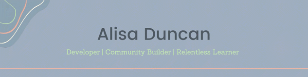
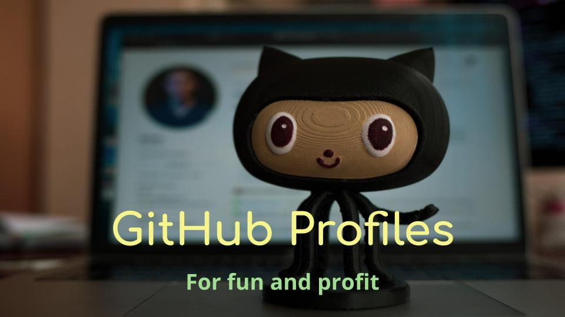
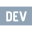

### Hi there! 👋

Welcome to my corner of GitHub! ✨

I'm a Senior Developer Advocate 🥑 at Okta, a full-stack developer, Pluralsight author, and a community builder who loves the thrill of learning new things. 🤩

---

#### I'm a fan of

#### And I want to learn more about

---

### I post on DEV.to

Here's a few of my recent posts. Want to see more? Find me on [DEV](https://dev.to/alisaduncan). 📖

<!-- BLOG-POST-LIST:START -->
- [Flexible Authentication Configurations in Angular Applications Using Okta](https://dev.to/oktadev/flexible-authentication-configurations-in-angular-applications-using-okta-5c7e)
- [How Authentication and Authorization Work for SPAs](https://dev.to/oktadev/how-authentication-and-authorization-work-for-spas-1e4h)
- [A Practical Guide to Providers in Angular](https://dev.to/angular/a-practical-guide-to-providers-in-angular-3c96)
- [Protect Your Angular App From Cross-Site Scripting](https://dev.to/oktadev/protect-your-angular-app-from-cross-site-scripting-26d4)
- [Protect Your Angular App From Cross-Site Request Forgery](https://dev.to/oktadev/protect-your-angular-app-from-cross-site-request-forgery-2hho)
<!-- BLOG-POST-LIST:END -->

---

### Sometimes I speak too

Check out my slides from some recent talks. 🗣

<table>
  <tr>
    <td>
     
    </td>
    <td>
     <a href="https://theressafetyinangular.alisaduncan.dev/">There's Safety in Angular</a>
    </td>
  </tr>
  <tr>
   <td>
     
   </td>
   <td>
     <a href="https://alisaduncan.github.io/component-harness/">Tidy Up Your Tests Using Component Harnesses</a>
   </td>
  </tr>
  <tr>
   <td>
     
   </td>
   <td>
     <a href="https://speakerdeck.com/alisaduncan/github-profiles-lightning-talk">GitHub Profiles Lightning Talk</a>
   </td>
  </tr>
  <tr>
   <td>
     
   </td>
   <td>
     <a href="https://alisaduncan.github.io/angular-animations/">Digging In To Angular Animations</a>
   </td>
  </tr>
</table>

### Let's keep in touch!

<!--
**alisaduncan/alisaduncan** is a ✨ _special_ ✨ repository because its `README.md` (this file) appears on your GitHub profile.

Here are some ideas to get you started:

- 🔭 I’m currently working on ...
- 🌱 I’m currently learning ...
- 👯 I’m looking to collaborate on ...
- 🤔 I’m looking for help with ...
- 💬 Ask me about ...
- 📫 How to reach me: ...
- 😄 Pronouns: ...
- ⚡ Fun fact: ...
-->
