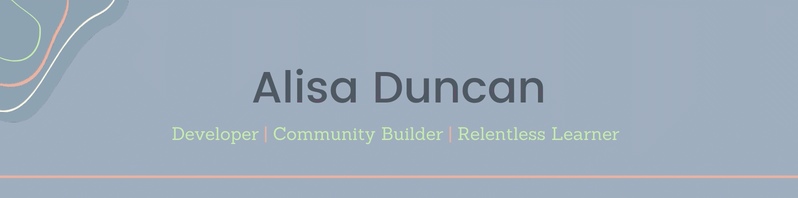

### Hi there!

Welcome to my corner of GitHub! ✨

---

#### I'm a fan of

#### And I want to learn more about

---

### I post on DEV

Check out my posts on [DEV](https://dev.to/alisaduncan). 📖

<!-- BLOG-POST-LIST:START -->
- [What You Need to Know about Angular v13](https://dev.to/oktadev/what-you-need-to-know-about-angular-v13-7fd)
- [The Things to Keep in Mind about Auth](https://dev.to/alisaduncan/the-things-to-keep-in-mind-about-auth-25eg)
- [Debugging and inspecting Angular apps using Angular DevTools](https://dev.to/alisaduncan/debugging-and-inspecting-angular-apps-using-angular-devtools-1e05)
- [Organizing a ngGirls Event](https://dev.to/alisaduncan/organizing-a-nggirls-event-70o)
- [How To Level Up Your Angular Unit Testing Game &lpar;3/3&rpar;](https://dev.to/alisaduncan/how-to-level-up-your-angular-unit-testing-game-33-5f3k)
<!-- BLOG-POST-LIST:END -->

---

### Let's keep in touch!

<!--
**alisaduncan/alisaduncan** is a ✨ _special_ ✨ repository because its `README.md` (this file) appears on your GitHub profile.

Here are some ideas to get you started:

- 🔭 I’m currently working on ...
- 🌱 I’m currently learning ...
- 👯 I’m looking to collaborate on ...
- 🤔 I’m looking for help with ...
- 💬 Ask me about ...
- 📫 How to reach me: ...
- 😄 Pronouns: ...
- ⚡ Fun fact: ...
-->
